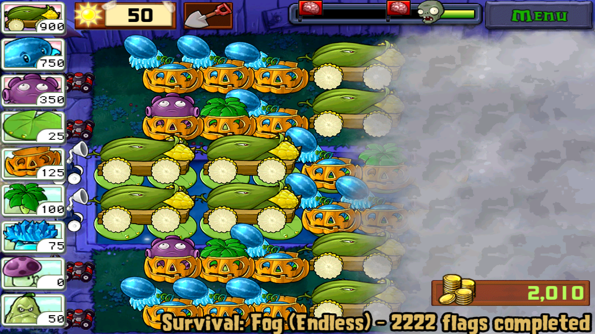
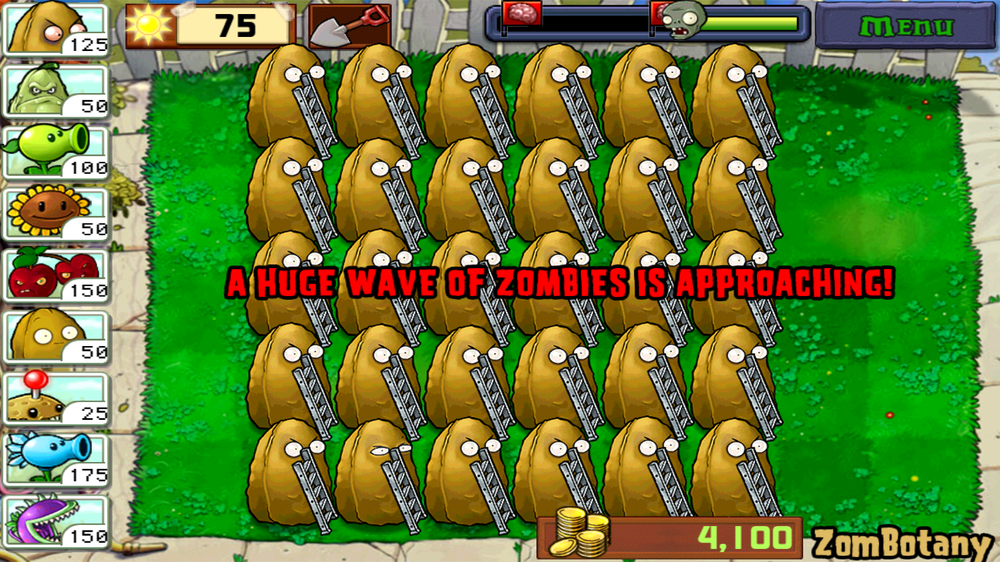
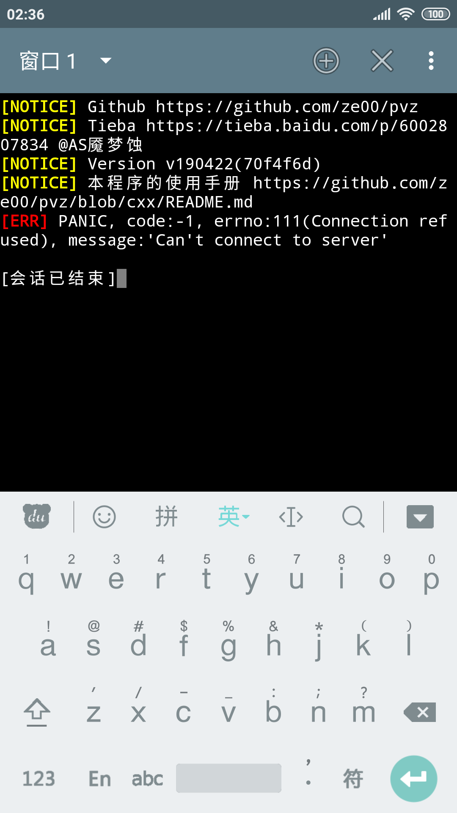
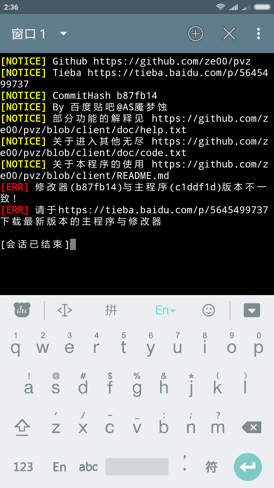

# PVZ小工具
  * 本人在aarch64/arm的Android 4.4.4、7.12、8.1、9.0中测试通过

  * 基于PvZ北美版6.1.1修改,基本的功能与6.1.1版一致

    

  * 效果

    

    
## 支持什么功能?
  |功能|功能|
  |:-----|:-----|
  |0.设置阳光|1.设置金币|
  |2.免费植物|3.禁用免费植物|
  |4.只出梯子|5.只出巨人|
  |6.阵型压力测试|7.自定义出怪列表|
  |8.通过本关|9.设置旗数|
  |10.设置模式|11.设置场景|
  |12.设置卡槽|13.设置冒险关卡|
  |14.自动拾取|15.取消自动拾取|
  |16.解锁各游戏模式|17.移动场上梯子僵尸|
  |18.触发推车|19.黄油糊脸|
  |20.打印僵尸对象|21.打印植物对象|
  |22.输出调试信息|
## 对游戏本体的修改之处
  * 此版本有五个无尽(购买了第一个游戏礼包后可以从Mini Games里进入)

  * 无需手动放置数据包
## 相关功能的使用文档
  [部分相关代码](doc/code.txt)
## 在百度贴吧的发布帖
  [【重制】PvZ北美版修改器](https://tieba.baidu.com/p/6111235972)
## 相关安装教程
  [存档的处理教程](http://lonelystar.org/ResDownload/1_Android_Na.htm)

  感谢植物大战僵尸吧@囧丫乙 提供的资源

## 使用步骤
  * 1.**下载植物大战僵尸、修改器**

    链接: https://pan.baidu.com/s/1kWUH3Kj 密码: 4hby

    下载链接中的PVZ_CHEATER_{更新日期}.zip解压后一并安装里边两个文件就可以了

    |文件名|描述|
    |:----:|:----:|
    |PVZ_CHEATER_{更新日期}-aligned-debugSigned.apk|修改器程序|
    |com.popcap.pvz_na_{更新日期}-aligned-debugSigned.apk|游戏本体|

    **每次更新时都需要一并安装对应的游戏本体**

    如果您使用了正确的主程序,则应该类似于

    

    如果您没有使用正确的主程序或者没有先打开PvZ,则

    

    如果您使用的主程序版本与修改器版本不匹配,则

    

## THANKS
  tools/uber-apk-signer-1.0.0.jar @ https://github.com/patrickfav/uber-apk-signer

  JackpalTerminal @ https://github.com/jackpal/Android-Terminal-Emulator
