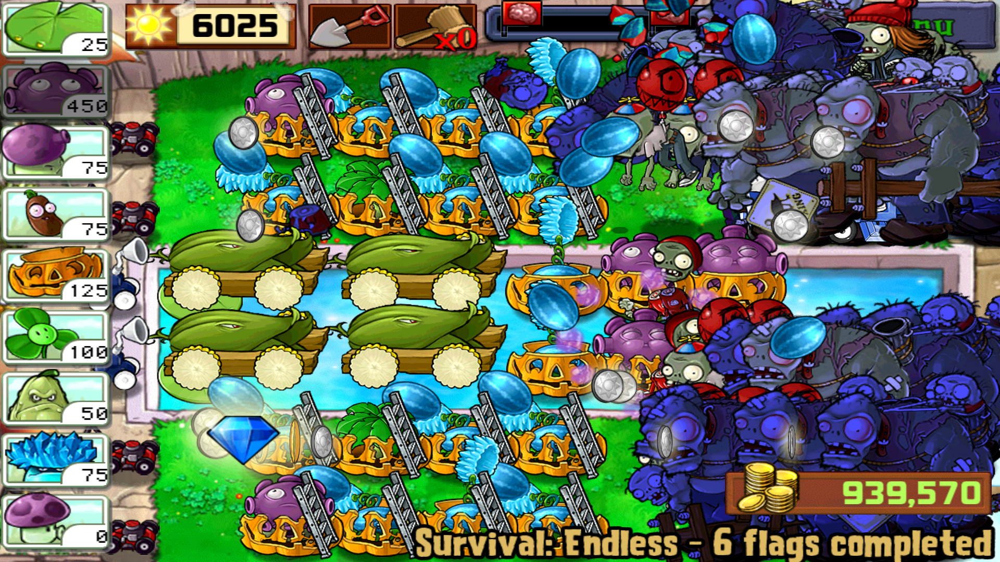

# PVZ小工具
  * 本人在aarch64/arm的Android 4.4.4、7.12、8.1中测试通过

    

  * 效果

    
## 支持什么功能?
  ```
  0.改阳光
  1.改金币
  2.免费植物
  3.关闭免费植物
  4.黄油糊脸
  5.只出梯子僵尸
  6.只出巨人僵尸
  7.搭梯
  8.炸荷叶烂南瓜
  9.阵型压力测试
  10.过关
  11.修改当前无尽轮数
  12.修改当前游戏模式
  13.冒险跳关
  14.过第二周目
  15.混乱存档
  16.修改第一个卡槽
  17.切换游戏场景类型
  18.自动收集物品
  19.取消自动收集
  20.触发场上推车
  21.输出调试信息
  (另,此版本有五个无尽(购买了第一个游戏礼包后可以从Mini Games里进入))
  ```
## 使用步骤
  * **获取一个北美版的植物大战僵尸**

    链接: https://pan.baidu.com/s/1kWUH3Kj 密码: 4hby

    请使用文件中的com.popcap.pvz_na_V{修改器版本}.apk,每更新一次修改器就需要再安装一次

    数据包、存档的处理教程:http://lonelystar.org/ResDownload/1_Android_Na.htm

    感谢植物大战僵尸吧@囧丫乙

  * 1.**使用直装版的修改器**

    链接: https://pan.baidu.com/s/1kWUH3Kj 密码: 4hby

    基于JackpalTerminal(https://github.com/jackpal/Android-Terminal-Emulator)

    如果您正确的放置了数据包、使用了正确的主程序,则应该类似于

    

    如果您没有使用正确的主程序或者没有先打开PvZ,则

    

    如果您使用的主程序版本与修改器版本不匹配,则

    
