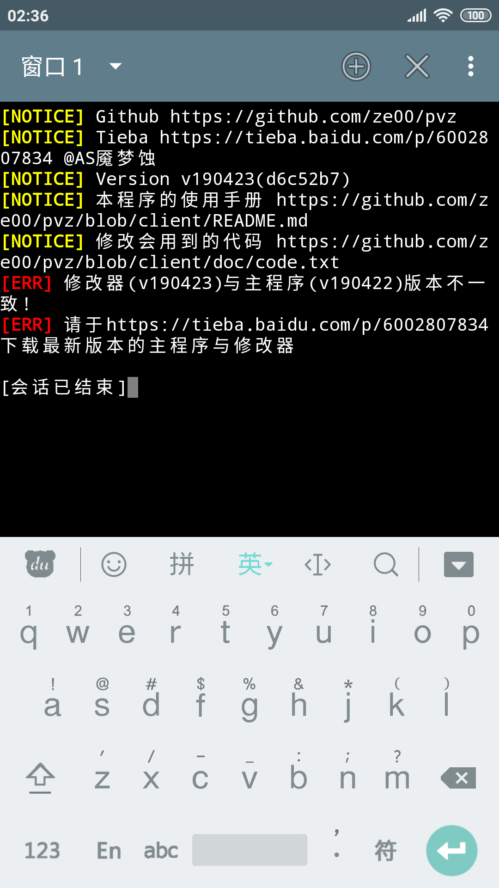

# PVZ小工具
  * 本人在aarch64/arm的Android 4.4.4、7.12、8.1中测试通过

    

  * 效果

    
## 支持什么功能?
  ```
  0.改阳光
  1.改金币
  2.免费植物
  3.关闭免费植物
  4.黄油糊脸
  5.只出梯子僵尸
  6.只出巨人僵尸
  7.搭梯
  8.炸荷叶烂南瓜
  9.阵型压力测试
  10.过关
  11.修改当前无尽轮数
  12.修改当前游戏模式
  13.冒险跳关
  14.过第二周目
  15.修改第一个卡槽
  16.切换游戏场景类型
  17.自动收集物品
  18.取消自动收集
  19.触发场上推车
  20.砸罐子随机效果
  21.取消砸罐子随机效果
  22.输出调试信息
  (另,此版本有五个无尽(购买了第一个游戏礼包后可以从Mini Games里进入))
  ```
## 相关功能的使用文档
  [部分功能解释](doc/help.txt)

  [部分相关代码](doc/code.txt)
## 相关安装教程
  [数据包、存档的处理教程](http://lonelystar.org/ResDownload/1_Android_Na.htm)

  [安装修改器教程](doc/install.md)

  感谢植物大战僵尸吧@囧丫乙 @豪哥e278提供的教程

## 使用步骤
  * 1.**获取一个北美版的植物大战僵尸**

    链接: https://pan.baidu.com/s/1kWUH3Kj 密码: 4hby

    **请使用链接中的com.popcap.pvz_na_V{修改器版本}.apk,每更新一次修改器就需要再安装一次**

  * 2.**使用直装版的修改器**

    链接: https://pan.baidu.com/s/1kWUH3Kj 密码: 4hby

    如果您正确的放置了数据包、使用了正确的主程序,则应该类似于

    

    如果您没有正确处理数据包,则会提示您**"You should have at least one active Google account on your device."**

    此时,请打开上面提到的两个教程,它们可以帮助您解决您的问题

    

    如果您没有使用正确的主程序或者没有先打开PvZ,则

    

    如果您使用的主程序版本与修改器版本不匹配,则

    

## THANKS
  tools/uber-apk-signer-1.0.0.jar @ https://github.com/patrickfav/uber-apk-signer
  JackpalTerminal @ https://github.com/jackpal/Android-Terminal-Emulator
