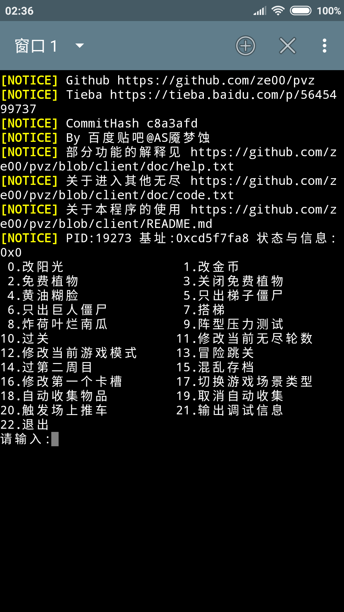

# PVZ小工具
  * 本人在aarch64/arm的Android 7.12中测试通过
    
  * 效果
    
## 支持什么功能?
```
    1.改阳光
    2.免费植物
    3.黄油糊脸
    4.搭梯
    5.炸荷叶烂南瓜
    6.输出调试信息
    7.过关
    8.修改当前无尽轮数
    9.只出梯子僵尸
    10.阵型压力测试
    11.跳关
    12.混乱存档
    13.冒险跳关
    14.改金币
    15.修改第一个卡槽

```
## 使用步骤
  * **获取一个北美版的植物大战僵尸**

    链接: https://pan.baidu.com/s/1kWUH3Kj 密码: 4hby

    请使用文件中的com.popcap.pvz_na_V{版本}.apk，每更新一次修改器就需要再安装一次

    数据包、存档的处理教程:http://lonelystar.org/ResDownload/1_Android_Na.htm

    感谢植物大战僵尸吧@囧丫乙

  * 1.**使用直装版的修改器**

    链接: https://pan.baidu.com/s/1kWUH3Kj 密码: 4hby

    基于JackpalTerminal(https://github.com/jackpal/Android-Terminal-Emulator)

    如果您已经启动了植物大战僵尸，则应该类似于
    
    否则，将会是
    
